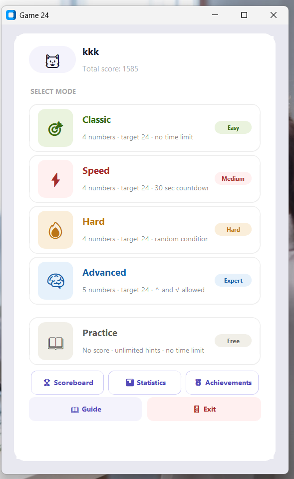
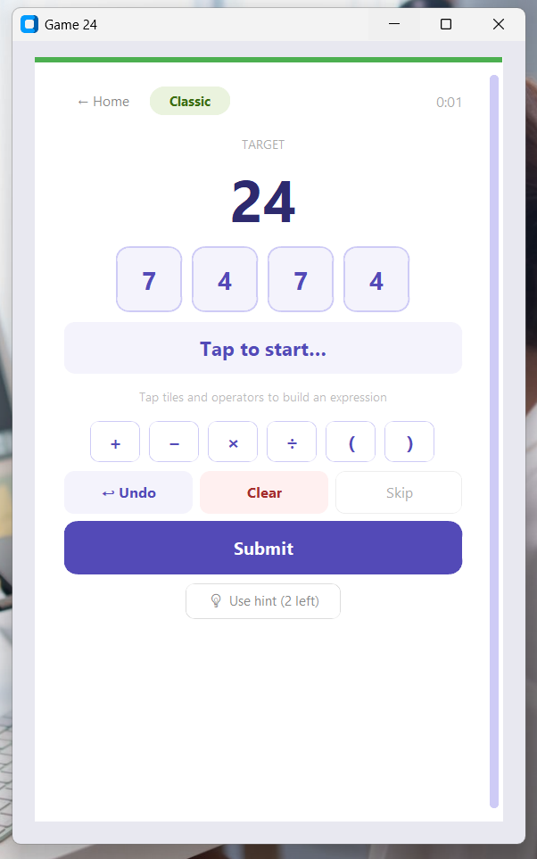
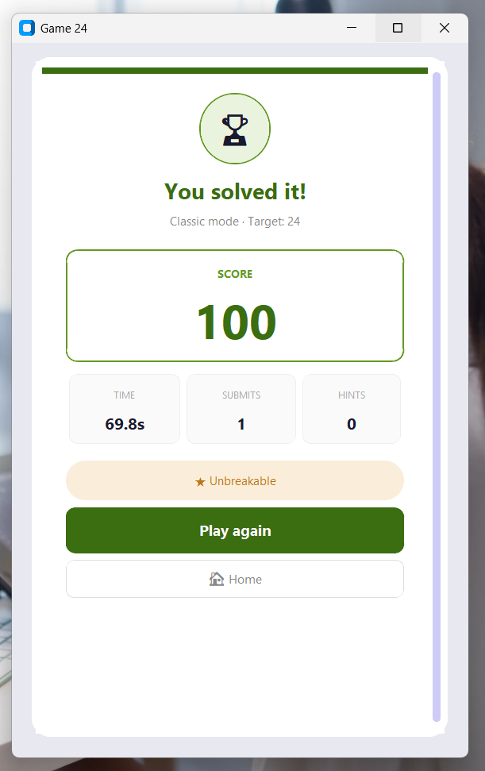
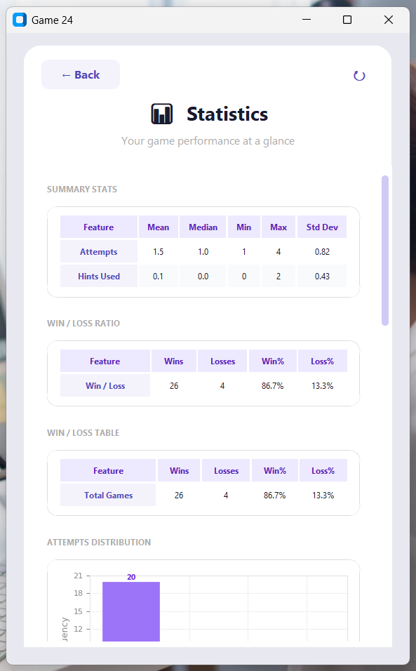
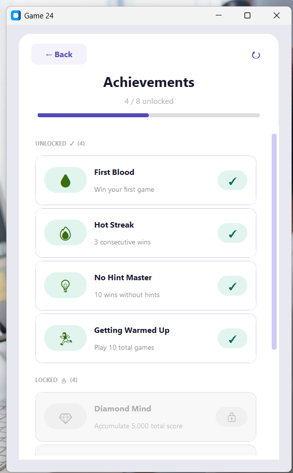
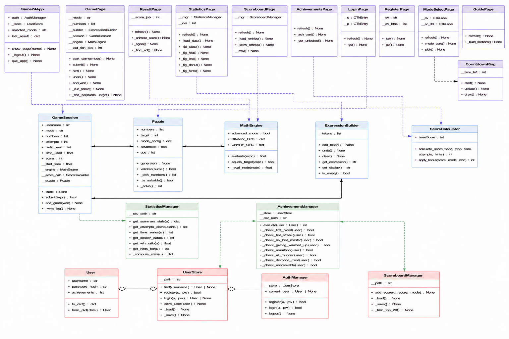

# Project Description

## 1. Project Overview

- **Project Name:** Game 24 Puzzle
- **Brief Description:**

  Game 24 Puzzle is an interactive math puzzle game based on the classic 24 Game. Players are given a set of numbers and must use mathematical operations — addition, subtraction, multiplication, and division — to create an expression that equals exactly 24, using each number exactly once.

  Unlike many basic implementations of the 24 Game, this project expands the experience with five game modes, a scoring system, achievements, a global scoreboard, and a statistics dashboard. Gameplay data is automatically recorded and visualized through charts and summary statistics so players can track their performance and improvement over time.

- **Problem Statement:**

  Most existing implementations of the 24 Game focus only on solving individual puzzles and provide little long-term engagement or performance tracking. This project addresses that limitation by adding structured game modes, persistent user accounts, real-time score tracking, achievements, and gameplay statistics visualization. These features create a more interactive and rewarding experience while also helping players monitor their progress and problem-solving performance over time.

- **Target Users:**

  - Students who want to practice arithmetic and logical thinking
  - Casual gamers who enjoy number puzzles
  - Anyone who wants to challenge themselves with math under time pressure

- **Key Features:**
  - 5 game modes: Classic, Speed, Hard, Advanced, Practice
  - Expression builder with tile-based input and keyboard support
  - Score system with time bonus and hint/attempt penalties
  - Achievements system with 8 unlockable achievements
  - Global scoreboard showing top 20 players by total score
  - Statistics dashboard with 5 chart types and a summary stats table
  - Persistent user accounts with password hashing
  - Automatic game log recording to CSV

- **Screenshots:**

  
  
  
  
  
  

  *(See `screenshots/` folder for all screenshots)*

- **Proposal:** [proposal.pdf](./proposal.pdf)

- **YouTube Presentation:**

  

  The video covers:
  1. A short intro and demonstration of all parts of the application — both the game and the statistics
  2. An explanation of the class design and its usage
  3. An explanation of the statistics and data visualization

---

## 2. Concept

### 2.1 Background

The 24 Game is a classic arithmetic puzzle that has long been used to improve mental math and logical thinking skills. Players must combine four numbers using arithmetic operations to reach the value 24, making the game both educational and entertaining.

This project was inspired by the people around me — friends and artists I admire — who enjoy playing the 24 Game together in their daily lives. Seeing it become a shared activity motivated me to create my own version with more depth, including multiple game modes, score tracking, achievements, and statistics. Most digital versions of the game are still very minimal, so I wanted to design a version that feels more interactive, competitive, and rewarding for players.

### 2.2 Objectives

- Build a fully playable 24 Game with five difficulty modes
- Implement a solvability checker to guarantee every puzzle has at least one valid solution before presenting it to the player
- Record gameplay data automatically after every session without interrupting gameplay
- Visualize gameplay statistics using charts and tables to help players understand their own performance
- Provide a user account system so multiple players can use the same application and track individual progress
- Apply object-oriented programming concepts to organize the application into reusable and maintainable components

---

## 3. UML Class Diagram

The class diagram below shows the main classes, their attributes, key methods, and relationships used in this project.

**Attachment:** [uml.pdf](./uml.pdf)

Main relationships:
- `Game24App` composes all page classes (`GamePage`, `ResultPage`, `StatisticsPage`, etc.)
- `GamePage` uses `GameSession`, `MathEngine`, `ExpressionBuilder`, and `Puzzle`
- `GameSession` uses `ScoreCalculator` to compute the final score
- `AchievementManager` reads from `UserStore` (part of `AuthManager`)
- `StatisticsManager` reads from `game_log.csv` and returns data to `StatisticsPage`
- `ScoreboardManager` reads/writes `scoreboard.json`

Most page classes follow a shared CTkFrame-based structure, allowing consistent navigation and reusable UI patterns across the application.

---

## 4. Object-Oriented Programming Implementation

| Class | File | Description |
|---|---|---|
| `User` | `auth.py` | Represents one user account. Stores username, hashed password, and list of unlocked achievement IDs. |
| `UserStore` | `auth.py` | Handles reading and writing `users.json`. Provides `find()`, `register()`, `login()`, and `save_user()`. |
| `AuthManager` | `auth.py` | Controls login/logout flow and holds the reference to the currently logged-in user. |
| `Puzzle` | `puzzle.py` | Generates a set of numbers and a target value. Uses a recursive brute-force solver to guarantee solvability before returning the puzzle. |
| `MathEngine` | `math_engine.py` | Evaluates the player's expression safely using Python's AST parser instead of `eval()`. Supports basic and advanced operators. |
| `ExpressionBuilder` | `expression_builder.py` | Maintains the list of tokens (numbers and operators) the player has entered. Provides `add_token()`, `undo()`, `clear()`, and display methods. |
| `GameSession` | `game_session.py` | Manages one complete game round. Tracks time, attempts, and hints used. Calls `ScoreCalculator` and writes the result to `game_log.csv`. |
| `ScoreCalculator` | `score_calculator.py` | Calculates the player's score using base score, time bonus, attempt penalty, and hint penalty. Returns 0 for losses and practice mode. |
| `ScoreboardManager` | `scoreboard.py` | Reads and writes `scoreboard.json`. Keeps only the top 20 entries sorted by score. |
| `StatisticsManager` | `game_stats.py` | Reads `game_log.csv` and computes summary statistics (mean, median, min, max, std dev) and data series for each chart. |
| `AchievementManager` | `achievements.py` | Evaluates all achievement conditions after each game session. Unlocks and saves newly earned achievements to the user record. |
| `Game24App` | `game24ui.py` | Main application window. Builds all pages and controls navigation between them. |
| `GamePage` | `game24ui.py` | The main gameplay screen. Handles puzzle display, tile input, expression building, timer, hints, and submission. |
| `ResultPage` | `game24ui.py` | Displays the outcome of each game session with score animation, stats summary, and a solution hint on loss. |
| `StatisticsPage` | `game24ui.py` | Loads player data and renders all charts and tables using matplotlib and seaborn. |
| `ScoreboardPage` | `game24ui.py` | Displays the top 20 scoreboard with rank badges and highlights the current player. |
| `AchievementsPage` | `game24ui.py` | Shows all achievements with unlock status and a progress bar. |
| `RegisterPage` | `game24ui.py` | Registration form with avatar selection. |
| `LoginPage` | `game24ui.py` | Login form with field validation. |
| `ModeSelectPage` | `game24ui.py` | Mode selection screen showing all 5 modes with navigation to Scoreboard, Statistics, and Achievements. |
| `GuidePage` | `game24ui.py` | How-to-play guide with step descriptions, example puzzle, scoring formula, and mode tips. |
| `_CountdownRing` | `game24ui.py` | Custom canvas widget that draws an animated circular countdown timer for Speed mode. |

---

## 5. Statistical Data

### 5.1 Data Recording Method

Gameplay data is recorded automatically to a CSV file (`data/game_log.csv`) at the end of every game session via `GameSession._write_log()`. No manual input is required from the player.

Each row in the CSV represents one completed session and contains:

| Column | Type | Description |
|---|---|---|
| `username` | string | The player who completed the session |
| `score` | integer | Final score for that session |
| `mode` | string | Game mode played (classic, speed, hard, advanced, practice) |
| `won` | integer | 1 = win, 0 = loss |
| `time_used` | float | Time taken in seconds |
| `attempts` | integer | Number of submit attempts |
| `hints_used` | integer | Number of hints used |
| `timestamp` | string | Date and time the session ended (YYYY-MM-DD HH:MM:SS) |

Data is collected at the game-session level. One value is recorded per completed game, making it straightforward to collect 100+ records by playing multiple sessions across different users and modes.

### 5.2 Data Features

The Statistics page analyzes the following features:

| Feature | Why collect it | Visualization |
|---|---|---|
| `attempts` | Measures how difficult each puzzle is for the player and overall problem-solving effort | Histogram + Summary stats table |
| `time_used` | Measures player speed and efficiency. Tracks improvement over multiple sessions | Line chart + Summary stats table |
| `attempts` vs `time_used` | Shows the relationship between solving time and player effort. The regression line helps identify overall performance trends and solving behavior patterns | Scatter plot with regression line |
| `won` | Measures overall win rate and success rate across all sessions | Donut pie chart + Win/Loss table |
| `hints_used` | Measures reliance on hints. Indicates puzzle difficulty perception | Bar chart + Summary stats table |

**Summary Statistics Table** (computed for `attempts` and `hints_used`):

| Statistic | Description |
|---|---|
| Mean | Average value across all sessions |
| Median | Middle value — less sensitive to outliers |
| Min | Lowest recorded value |
| Max | Highest recorded value |
| Std Dev | Spread of values — higher means more inconsistent performance |

---

## 6. Changed Proposed Features

- The Advanced Mode was originally proposed to use a higher number range and a flexible target value. In the final implementation, the target is fixed at 24 across all modes for consistency.
- A `timestamp` column was added to `game_log.csv` to record when each session ended. This was not included in the original proposal.

---

## 7. Limitations

- Puzzle generation relies on recursive brute-force solving, which may become slower if the number range or operator complexity is increased significantly
- Gameplay statistics are stored locally using CSV and JSON files and are not synchronized online
- The application currently supports only single-player gameplay
- The game is designed for desktop environments and has not been optimized for mobile devices

---

## 8. External Sources

| Type | Name / Source | License |
|---|---|---|
| UI Framework | [CustomTkinter](https://github.com/TomSchimansky/CustomTkinter) by Tom Schimansky | MIT |
| Sound | [Pygame](https://www.pygame.org) | LGPL |
| Data Analysis | [Pandas](https://pandas.pydata.org) | BSD |
| Numerical Computing | [NumPy](https://numpy.org) | BSD |
| Visualization | [Matplotlib](https://matplotlib.org) | PSF |
| Visualization | [Seaborn](https://seaborn.pydata.org) by Michael Waskom | BSD |

- Sound effects were procedurally generated in Python using NumPy and Pygame, without using external audio assets.

---

## 9. Additional Self-Study

CustomTkinter was not part of the core course content, but it was briefly introduced during class. After studying it further independently, I found that it was a suitable framework for building a more modern and visually organized Python application.

Compared to standard Tkinter, CustomTkinter provides better support for modern UI design, reusable components, dark mode, and easier customization. Because of these advantages, I decided to use it as the primary UI framework for the entire project.

- Documentation: https://customtkinter.tomschimansky.com
