# Visualization Documentation

This document describes all data visualizations in the Statistics page of Game 24 Puzzle.
All data is collected automatically from `game_log.csv` after each game session and visualized using **Matplotlib** and **Seaborn**.

---

## Overview

The Statistics page provides a full overview of the player's gameplay performance. It includes a summary statistics table, win/loss ratio tables, and five chart types: a histogram, a line chart, a scatter plot, a donut chart, and a bar chart. All data shown is filtered by the currently logged-in user, so each player sees only their own statistics. The page loads data from `game_log.csv` automatically every time it is opened.

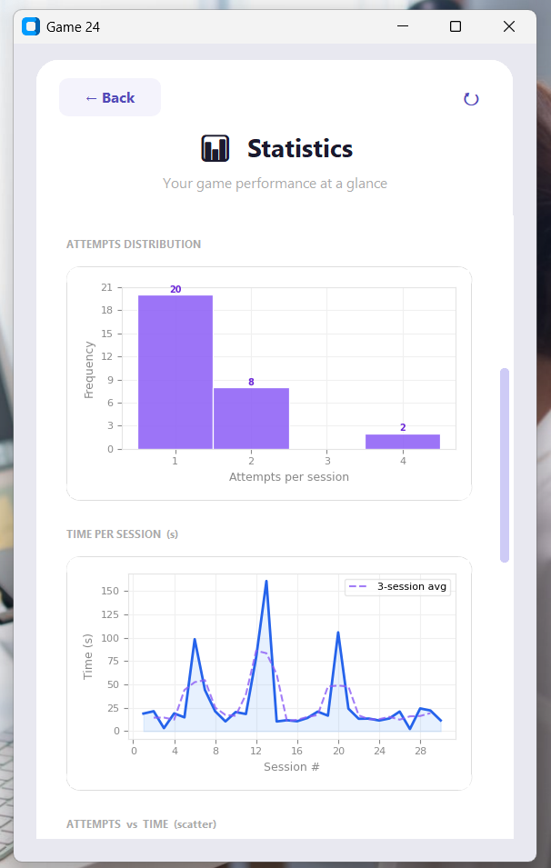
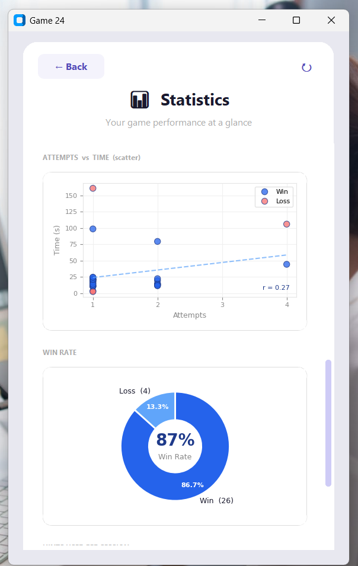
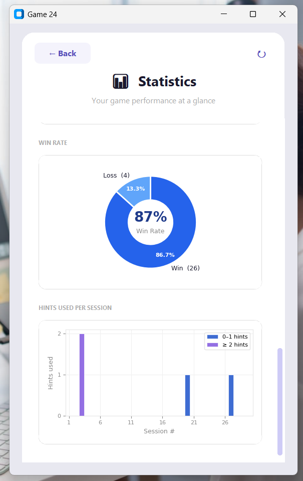

---

## 1. All Tables Overview

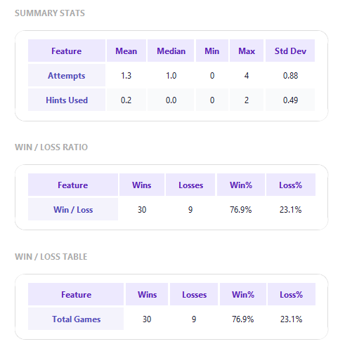

This screenshot shows all three data tables together: the Summary Statistics Table, the Win/Loss Ratio Table, and the Win/Loss Table. Together they provide a complete numerical summary of the player's performance across all recorded sessions.

---

## 2. Summary Statistics Table

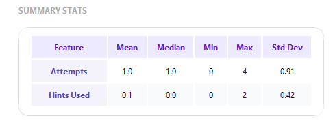

The Summary Statistics Table shows descriptive statistics for two key features: **Attempts** and **Hints Used**. For each feature, the table displays the mean, median, minimum, maximum, and standard deviation across all recorded sessions. This table gives a quick overview of the player's consistency — a low standard deviation in attempts means the player solves puzzles with a reliable and stable number of tries, while a high value indicates more variation in difficulty.

---

## 3. Win / Loss Ratio Table

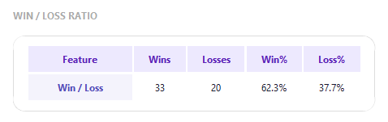

The Win/Loss Ratio Table summarizes the player's overall game results. It shows the total number of wins and losses, along with the win percentage and loss percentage. This table is useful for understanding the player's general success rate at a glance without needing to look at charts.

---

## 4. Attempts Distribution (Histogram)

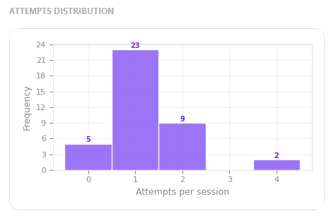

The Attempts Distribution histogram shows how many times the player typically needs to submit an expression before solving the puzzle correctly. The x-axis represents the number of attempts per session, and the y-axis shows the frequency. A spike at 1 attempt indicates that the player often solves the puzzle on the first try, which reflects strong mental math skills. This histogram helps identify whether the player tends to solve puzzles quickly or needs multiple tries.

---

## 5. Time Per Session (Line Chart)

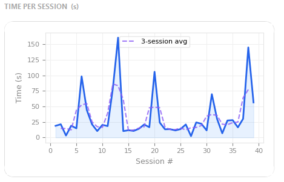

The Time Per Session line chart shows how long the player takes to solve each puzzle across all sessions, plotted in session order. The x-axis is the session number and the y-axis is the time in seconds. A dashed line shows the 3-session rolling average when there are enough data points, helping to smooth out outliers and reveal the overall trend. If the line trends downward over time, it indicates that the player is getting faster at solving puzzles.

---

## 6. Attempts vs Time (Scatter Plot)

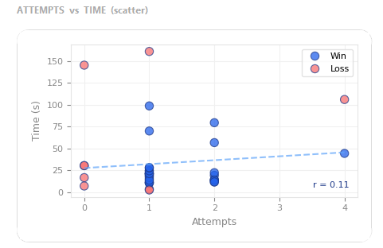

The Attempts vs Time scatter plot shows the relationship between the number of attempts and the time used per session. Each dot represents one game session, colored blue for wins and red for losses. A dashed regression line is added when there are enough data points, and the correlation coefficient (r) is displayed in the corner. The regression line helps identify overall performance trends and solving behavior patterns.

---

## 7. Win Rate (Donut Chart)

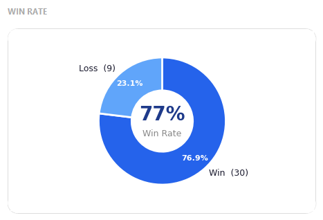

The Win Rate donut chart shows the proportion of wins and losses across all sessions. The center of the chart displays the overall win rate percentage. This visualization makes it immediately clear at a glance how often the player wins, without needing to read through raw numbers. A large blue section indicates a high win rate.

---

## 8. Hints Used Per Session (Bar Chart)

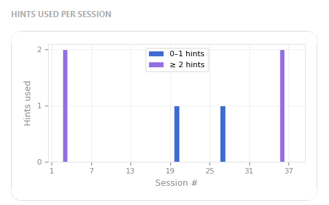

The Hints Used Per Session bar chart shows how many hints the player used in each session, displayed in session order on the x-axis. Bars are color-coded: blue for sessions where 0–1 hints were used, and purple for sessions where 2 or more hints were used. This chart helps identify which sessions were more difficult and whether the player's reliance on hints is decreasing over time, which would suggest improving puzzle-solving ability.
